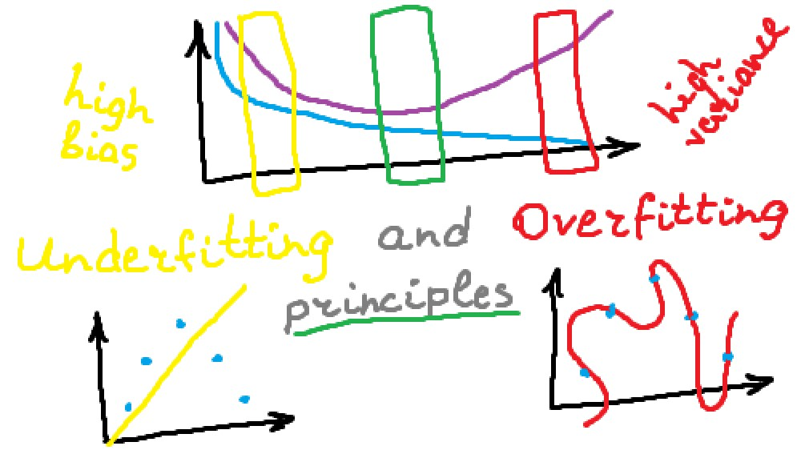

# Overfitting and Underfitting principles

Understand basic principles of underfitting and overfitting and why you should use particular techniques to deal with them.



## Article

You can read detailed article on [Towards Data Science](https://towardsdatascience.com/overfitting-and-underfitting-principles-ea8964d9c45c) or directly on [GitLab](https://gitlab.com/Winston-90/underfitting_vs_overfitting/-/blob/main/principles.md).

## Jupyter Notebooks

See Jupiter notebooks, that contain all examples from article:
- [bias_variance.ipynb](https://gitlab.com/Winston-90/underfitting_vs_overfitting/-/blob/main/bias_variance.ipynb), which contains Python code to plot bias-variance plots from article
- [underfitting_vs_overfitting.ipynb](https://gitlab.com/Winston-90/underfitting_vs_overfitting/-/blob/main/underfitting_vs_overfitting.ipynb), which contains all other materials

Open them with [Jupyter](https://jupyter.org/) or see directly in a browser.

## Setup

To run this code, you must have *numpy*, *sklearn*, *matplotlib* and *seaborn* libraries installed.

You should create virtual environment, activate it and run `pip install -r requirements.txt` or run following commands:

```
pip install numpy
pip install scikit-learn
pip install matplotlib
pip install seaborn
```
