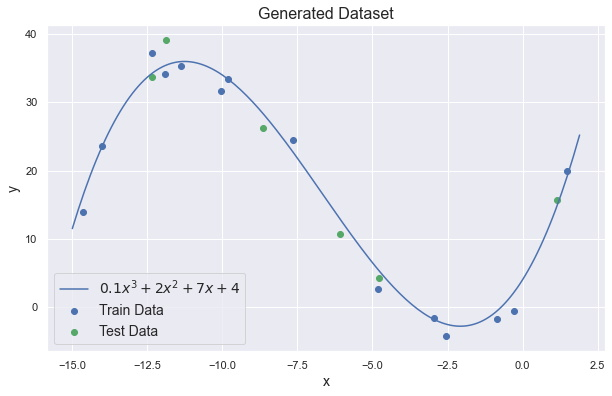
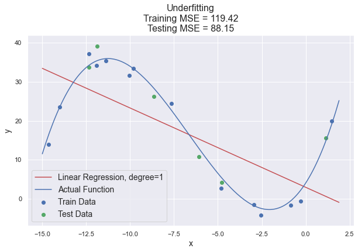
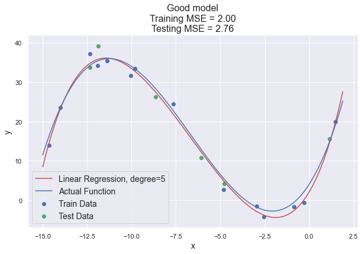
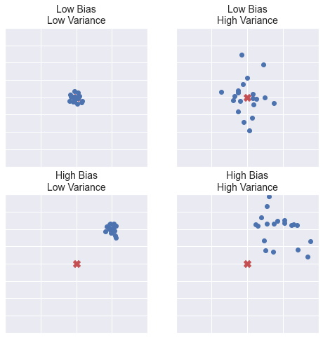
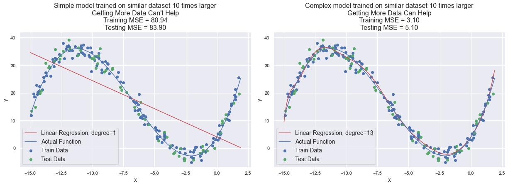

# Overfitting and Underfitting principles
## Understand what it is and why you should use particular techniques to prevent this

A lot of articles have been written about overfitting, but almost all of them *are simply a list of tools*. "How to handle overfitting - top 10 tools" or "best techniques to prevent overfitting". *It's like being shown nails without explaining how to hammer them*. It can be very confusing for people who are trying to figure out how overfitting works. Also, these articles often do not consider underfitting, as if it does not exist at all.

In this article, I would like to list the **basic principles** (exactly *principles*) for improving the quality of your model and, accordingly prevent underfitting and overfitting on a particular example. This is a very general issue that can apply to all algorithms and models, so it is very difficult to fully describe it. But I want to try to give you an *understanding* of why underfitting and overfitting occur and why one or another technique should be used.

## Underfitting and Overfitting and Bias/Variance Trade-off

Although I'm not describing all the concepts you need to know here (for example, *quality metrics* or *cross-validation*), I think it's important to explain to you what underfitting/overfitting is.

To figure this out, let's create some dataset, split it into train and test (I will not use a validation set in this example to simplify it, but I will tell about it later), and then train three models on it - simple, good and complex. All code is available in [gitlab repo](https://gitlab.com/Winston-90/underfitting_vs_overfitting).

|  |
|:--:|
| <b>Generated dataset. Image by Author</b>|

**Underfitting** is a situation when your model is **too simple** for your data. More formally, your hypothesis about data distribution is wrong and too simple - for example, your data is quadratic and your model is linear. 
This situation is also called **high bias**. This means that your algorithm can do accurate predictions, but the initial assumption about the data is incorrect.

|  |
|:--:|
| <b>Underfitting. The linear model is applied to cubic data. Image by Author</b>|

Opposite, **overfitting** is a situation when your model is **too complex** for your data. More formally, your hypothesis about data distribution is wrong and too complex - for example, your data is linear and your model is high-degree polynomial.
This situation is also called **high variance**. This means that your algorithm can't do accurate predictions - by changing the input data only a little, the model output changes very much.

|  |
|:--:|
| <b>Overfitting. The 13-degree polynomial model is applied to cubic data. Image by Author</b>|

These are two extremes of the same problem and the optimal solution always lies somewhere in the middle.

|  |
|:--:|
| <b>Good model. The 5-degree polynomial model is applied to cubic data. Image by Author</b>|

I will not talk much about bias/variance trade-off, you can read about it [here](https://towardsdatascience.com/understanding-the-bias-variance-tradeoff-165e6942b229).

|  |
|:--:|
| <b>Bias and Variance options on four plots. Image by Author</b>|

But let me briefly mention possible options:
- low bias, low variance - just right.
- low bias, **high variance** - **overfitting** - the algorithm outputs very different predictions for similar data.
- **high bias**, low variance - **underfitting** - the algorithm outputs similar predictions for similar data, but predictions are wrong (algorithm "miss").
- high bias, high variance - very bad algorithm. You will most likely never see this.

All these cases can be placed on the same plot. It is a bit less clear than the previous one but more compact.

|  |
|:--:|
| <b>Bias and Variance options on one plot. Image by Author</b>|

## Tools

Now let's look at techniques of fighting with underfitting and overfitting, considering exactly *why you should use them*.

### General Intuition You Should Remember and How to Detect Underfitting and Overfitting

However, before we move on to the tools, let's understand how to "diagnose" underfitting and overfitting.

**Underfitting** means that your model makes accurate, but initially incorrect predictions. In this case **train error is large and val/test error is large** too.

**Overfitting** means that your model makes correct, but not accurate predictions. In this case **train error is very small and val/test error is large**.

When you find a **gool model**, **train error is small** (but larger than in case of overfitting) and **val/test error is small** too.

|  |
|:--:|
| <b>How to diagnose underfitting and overfitting. Image by Author</b>|

In the case above, the test error and validation error is approximately the same. This happens when everything is fine, and your *train, validation and test data have the same distributions*. If validation and test error are very different, then you need to get more data similar to test data and make sure that you split the data correctly.

Simple intuition you should remember:
- **underfitting** occurs when your model is **too simple**.
- **overfitting** occurs when your model is **too complex**.

### More Features / Less Features

### More Regularization / Less Regularization

### Why Getting More Data Sometimes Can't Help

One of the techniques to combat overfitting is to get more data. However, surprisingly, this may not always help. Let's generate a simular dataset 10 times larger and train the same models on it.

|  |
|:--:|
| <b>Why getting more data sometimes can't help. Image by Author</b>|

A very simple model (degree 1) has remained simple, almost nothing has changed. So **getting more data will not help in case of underfitting**.

But the complex model (degree 13) has changed for the better. It is still worse than the initially good model (degree 3), but much better than the original one. Why did this happen?

Last time (for the initial dataset), the model was trained on 14 points (*20 (initial data set size) * 0.7 (train ratio) = 14 data points*). A 13-degree polynomial can perfectly match these data (by analogy, we can draw an ideal straight line (degree = 1) through 2 points, an ideal parabola (degree = 2) through 3 points - and so on). By getting 10 times more data, the size of our train set is now 140 data points. To perfectly match these data, we need a 139-degree polymonial!

Note that if we had initially trained a VERY complex model (for example, 150-degree polynomial), such increase in data would not have helped. So get more data is a good way to improve the quality of the model, but it may not help if the model is very very complex.

So, the conclusion is - **getting more data can help only with overfitting (not underfitting) and if your model is not TOO complex**. 

In the context of computer vision, getting more data can also mean *data augmentation*. 

## Summary

Let's summarize everything in one table. Well, better in two.

Table

You may notice that to eliminate underfitting and overfitting, you need to apply diametrically opposite actions. So if you initially "misdiagnosed" your model, you can spend a lot of time and money on empty work (for example, getting new data when in fact you need to complicate the model).

Ceiling analysis
Error analysis

Based on the results of the quality assessment, it is very important to understand exactly where to move and what to pay attention to. Otherwise, you can spend days and weeks of work on improving the part of the model that will not give a large increase in total quality.